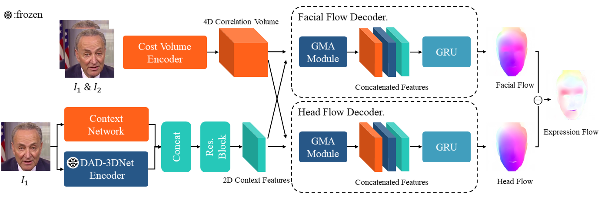
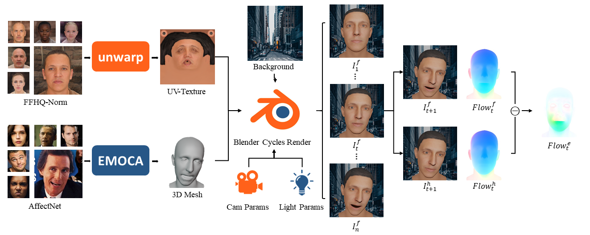

<!--
 * @Date: 2024-07-24 14:27:51
 * @LastEditors: ljz 
 * @LastEditTime: 2024-11-04 11:03:35
 * @FilePath: \X-Gaussiand:\desktop\study\FacialFlowNet\README.md
 * @Description: 
 * 
 * Copyright (c) 2024 by Fudan University/Shanghai Key Laboratory of Intelligent Information Processing, All Rights Reserved. 
-->
# FacialFlowNet
Official release of FacialFlowNet: Advancing Facial Optical Flow Estimation with a Diverse Dataset and a Decomposed Model (ACMMM2024)

## DecFlow

```Shell
```
Coming soon ......

## Demos


## FacialFlowNet Dataset

You can download the FacialFlowNet dataset from [here](https://pan.baidu.com/s/1u9fQsGdqhjqDN6jVhXxNrA) with the extraction code `c2z2`, and extract the compressed file to the following path:
```Shell
├── FacialFlowNet
    ├── image
        ├── facial
            ├── train 
            ├── test 
            ├── val
        ├── head
            ├── ...
    ├── flow
        ├── facial
            ├── train 
            ├── test 
            ├── val
        ├── head
            ├── ...
    ├── mask
        ├── ...
```

## Acknowledgement
Parts of code are adapted from the following repositories. We thank the authors for their great contribution to the community:
* [RAFT](https://github.com/princeton-vl/RAFT)
* [GMA](https://github.com/zacjiang/GMA)
* [DAD-3DHeads](https://github.com/PinataFarms/DAD-3DHeads)

## Citation
If you use the FacialFlowNet Dataset and/or DecFlow - implicitly or explicitly - for your research projects, please cite the following paper:
```Shell
@inproceedings{lu2024facialflownet,
  title={FacialFlowNet: Advancing Facial Optical Flow Estimation with a Diverse Dataset and a Decomposed Model},
  author={Lu, Jianzhi and He, Ruian and Zhou, Shili and Tan, Weimin and Yan, Bo},
  booktitle={Proceedings of the 32nd ACM International Conference on Multimedia},
  pages={2194--2203},
  year={2024}
}
```